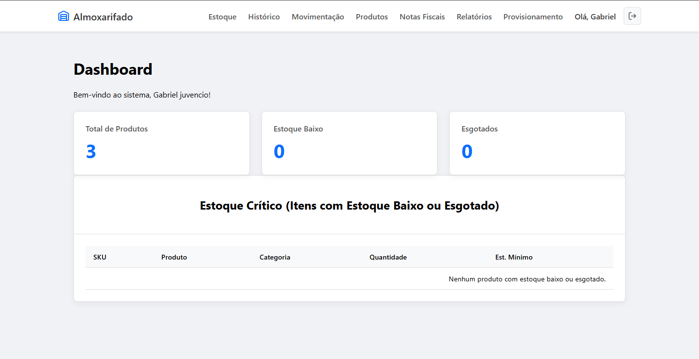
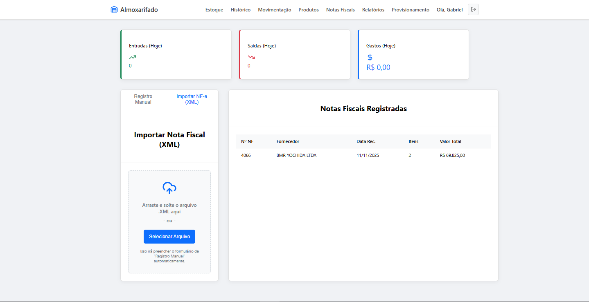
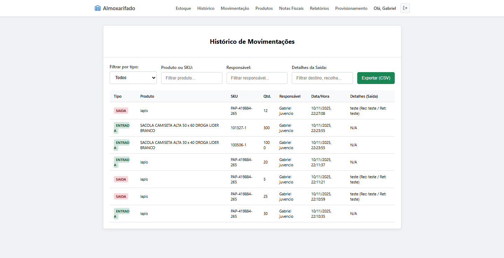

# Sistema de Gestão de Almoxarifado (SGA) 📦

   

## 📖 Sobre o Projeto

O **SGA** é uma aplicação Full Stack desenvolvida para modernizar a gestão de logística e controle de estoque. O sistema substitui processos manuais e planilhas por um fluxo automatizado que gerencia entradas via Nota Fiscal (XML), saídas por centro de custo e utiliza inteligência de dados para previsão de compras.

O grande diferencial técnico deste projeto é o módulo de **Provisionamento**, que implementa um algoritmo de média de consumo histórica para calcular a "saúde" do estoque e alertar sobre a necessidade de reposição com base em dados reais (30, 60 ou 90 dias).

---

## 📸 Screenshots

| Dashboard (Visão Geral) | Provisionamento (Forecast) |
|:-----------------------:|:--------------------------:|
|  |  |

| Importação de XML (NFe) | Histórico de Movimentação |
|:-----------------------:|:-------------------------:|
|  |  |


---

## 🚀 Funcionalidades Principais

* **📦 Controle de Estoque em Tempo Real:** Registro de entradas e saídas com validação de saldo e bloqueio de retirada sem estoque.
* **📄 Automação de NF-e:** Parser de arquivos XML (`xml2js`) que lê notas fiscais reais, converte unidades de compra (ex: caixas) para unidades de estoque e dá entrada automática.
* **🔮 Provisionamento Inteligente:** Algoritmo que projeta a duração do estoque atual baseado no histórico de consumo, indicando exatamente quando comprar.
* **🔐 Segurança & Autenticação:** Sistema de login robusto com **JWT (JSON Web Tokens)** e cookies `HttpOnly` para prevenir ataques XSS.
* **🖨️ Etiquetagem:** Geração dinâmica de etiquetas com código de barras para organização física.
* **📊 Relatórios Gerenciais:** Exportação de dados para CSV e filtros avançados por período, categoria e fornecedor.

---

## 🛠️ Tecnologias Utilizadas

O projeto foi construído utilizando uma arquitetura **Monorepo**, separando responsabilidades:

### Front-end (`/client`)
* **React.js** (Vite)
* **CSS Modules** (Design System próprio e responsivo)
* **Context API** (Gestão de Estado Global e Autenticação)
* **React Router DOM** (Roteamento protegido)
* **Lucide React** (Iconografia)

### Back-end (`/server`)
* **Node.js** & **Express** (API RESTful)
* **MySQL** (Banco de Dados Relacional)
* **Multer** (Upload de Arquivos)
* **Bcrypt & JWT** (Criptografia e Segurança)

---

## ⚡ Como Rodar o Projeto

### Pré-requisitos
* Node.js (v16+)
* MySQL

### 1. Configuração do Banco de Dados
1. Crie um banco de dados no MySQL chamado `almoxarifado`.
2. Execute o script SQL localizado em `database/schema.sql` para criar as tabelas e o usuário administrador inicial.
   - *Dica:* Você pode usar o comando: `mysql -u root -p almoxarifado < database/schema.sql`

### 2. Configurando o Back-end
```bash
cd server
npm install

# Crie um arquivo .env baseado no exemplo
cp .env.example .env

# Edite o .env com sua senha do MySQL
# Inicie o servidor
npm start
